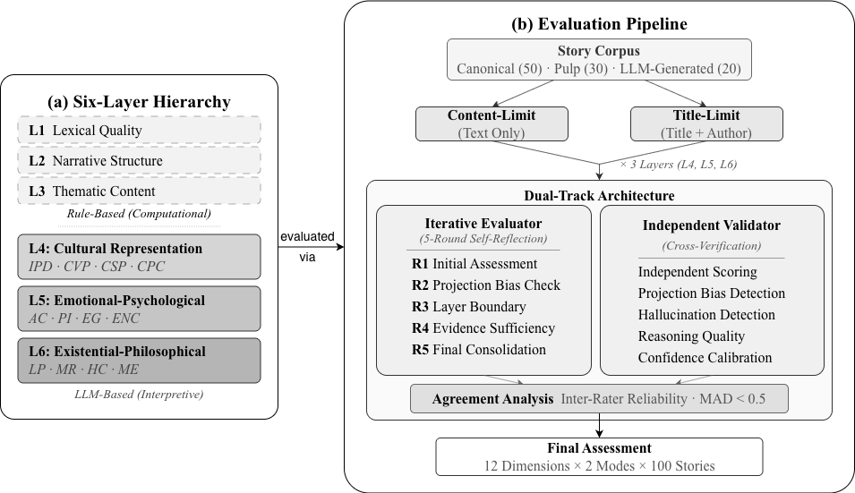

# SAGE Framework

<div align="center">

**Six-layer Automated Generation and Evaluation Framework**

A comprehensive framework for multi-dimensional narrative quality assessment combining rule-based metrics and LLM-powered evaluation.

[](https://python.org)
[](LICENSE)
[](https://arxiv.org/abs/2605.07102)

**[🚀 Quick Start](#-quick-start)** • [Architecture](#-architecture) • [Results](#-experimental-results) • [Research](#-research)

</div>

---

## 📖 Overview

**SAGE Framework** is a comprehensive system for multi-dimensional narrative quality assessment. It evaluates literary texts across six hierarchical layers, combining rule-based linguistic analysis (Layers 1-3) with LLM-powered semantic evaluation (Layers 4-6).

### Key Features

- **📊 Six-Layer Evaluation** - From lexical features to existential depth
- **🤖 Hybrid Approach** - Rule-based + LLM evaluation
- **📚 100 Stories** - Curated corpus (50 canonical, 30 pulp, 20 LLM-generated)
- **🔬 Research-Grade** - Designed for computational narrative analysis
- **⚡ Production-Ready** - Scalable batch processing with gpt-5-mini

---

## 🎯 Evaluation Layers

| Layer | Name | Type | Metrics |
|-------|------|------|---------|
| **Layer 1** | Lexical | Rule-based | TTR, hapax legomena, word length |
| **Layer 2** | Syntactic | Rule-based | Entity coherence, event sequences |
| **Layer 3** | Semantic | Rule-based | Theme extraction, semantic networks |
| **Layer 4** | Cultural | LLM | Cultural depth, context analysis |
| **Layer 5** | Emotional | LLM | Emotional arc, affective impact |
| **Layer 6** | Existential | LLM | Philosophical depth, life concerns |

---

## ✨ Quick Start

### Installation

```bash
# Clone and setup
git clone <repository>
cd sageFramework
pip install -r requirements.txt

# Configure API key
echo "OPENAI_API_KEY=your_key" > .env
```

### Basic Usage

```bash
# Evaluate all 54 stories with GPT-5-mini (baseline)
PYTHONPATH=src ./.venv/bin/python scripts/batch_evaluate.py \
  --profile gpt5mini \
  --skip-confirmation

# Generate analysis report
PYTHONPATH=src ./.venv/bin/python scripts/analyze_results.py -o report.txt
```

---

## 📊 Experimental Results

Full results for 600 evaluations (100 stories × 3 layers × 2 modes) are in [`results/`](results/).

### Genre Comparison (L4–L6, all p < 0.001)

| Layer | Canonical | Pulp | LLM-Generated | Can–LLM Gap | Cohen's d |
|-------|-----------|------|---------------|-------------|-----------|
| L4 Cultural | 3.96 ± 0.41 | 3.83 ± 0.36 | 2.55 ± 0.62 | +1.41 (35.6%) | **2.68** |
| L5 Emotional | 4.15 ± 0.31 | 4.04 ± 0.24 | 3.36 ± 0.59 | +0.79 (19.1%) | **1.68** |
| L6 Existential | 3.95 ± 0.57 | 3.68 ± 0.56 | 2.59 ± 0.57 | +1.36 (34.5%) | **2.40** |

### Reliability Metrics

| Metric | Value |
|--------|-------|
| Success rate | 600/600 (100%) |
| Convergence rate (R4→R5, \|Δ\| < 0.3) | 98.8% |
| Inter-rater agreement (MAD < 0.5) | > 94% |
| Mode invariance (max \|content − title\|) | 0.05 |

---

## 🏗️ Architecture

### Evaluation Pipeline



### Key Components

#### 1. Rule-Based Metrics (Layers 1-3)
- **Lexical**: Type-token ratio, vocabulary richness
- **Syntactic**: Entity grids, event sequences
- **Semantic**: TF-IDF themes, concept graphs

#### 2. LLM Judges (Layers 4-6)
- **Cultural**: GPT-5 / GPT-5-mini
- **Emotional**: GPT-5 / Gemini-2.5-Pro
- **Existential**: GPT-5 / GPT-5-mini

#### 3. Corpus
100 short stories across three quality categories:
- **Canonical (50)**: Poe, Chekhov, Maupassant, Kafka, Hemingway, Borges, Joyce, Lu Xun, Garcia Marquez, Woolf, and others
- **Pulp Fiction (30)**: Commercial genre fiction from *All-Story*, *Weird Tales*, *Black Mask* (1880–1950)
- **LLM-Generated (20)**: Multi-model generated stories with stratified quality tiers

---

## 📚 Documentation

- **[config/llm_models.yaml](config/llm_models.yaml)** - LLM model configurations
- **[results/](results/)** - Full evaluation results (600 evaluations)

---

## 🔬 Research

> **Note**: The associated paper is currently under review. Citation information will be updated upon acceptance.

### Citation

If you use this framework in your research, please cite:

```bibtex
@misc{wang2026sagehierarchicalllmbasedliterary,
      title={SAGE: Hierarchical LLM-Based Literary Evaluation through Ontology-Grounded Interpretive Dimensions},
      author={Tianyu Wang and Nianjun Zhou},
      year={2026},
      eprint={2605.07102},
      archivePrefix={arXiv},
      primaryClass={cs.CL},
      url={https://arxiv.org/abs/2605.07102},
}
```

### Publications

- Paper: [arXiv:2605.07102](https://arxiv.org/abs/2605.07102) (under review)
- Dataset: 100 short stories (50 canonical + 30 pulp + 20 LLM-generated), see [`results/`](results/)
- Code: This repository

---

## 📊 Project Status

### ✅ Completed
- [x] Six-layer evaluation pipeline
- [x] Rule-based metrics (Layers 1-3)
- [x] LLM judges (Layers 4-6)
- [x] OpenAI API compatibility (GPT-5, GPT-5-mini)
- [x] Batch evaluation system
- [x] Analysis and reporting tools
- [x] 100-story corpus curation

### 🔧 Recent Fixes (2025-11-21)
- [x] Layer 2/3 scoring normalization (3x improvement)
- [x] OpenAI GPT-5-mini API compatibility
- [x] Temperature parameter handling
- [x] Complete evaluation pipeline verification

---

## 🤝 Contributing

Contributions welcome! Feel free to open an issue or submit a pull request.

---

## 📄 License

This project is licensed under the Apache License 2.0 - see [LICENSE](LICENSE) file for details.

---

## 🙏 Acknowledgments

- OpenAI for GPT models
- Google for Gemini models
- The authors of the 100 stories in our corpus

---

**Questions?** Open an issue on GitHub.
